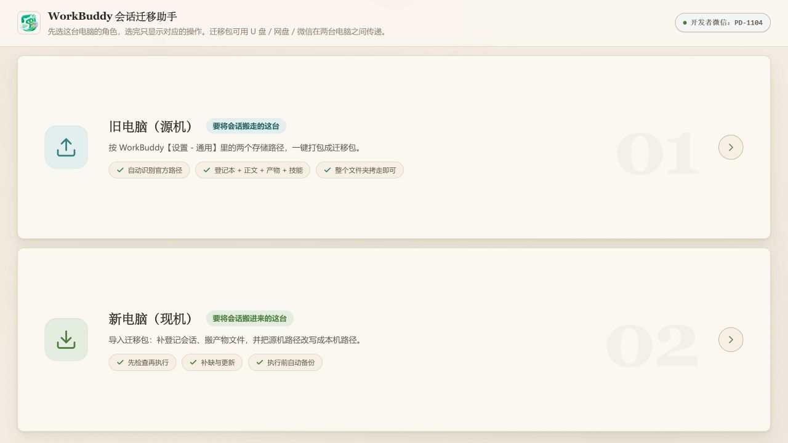
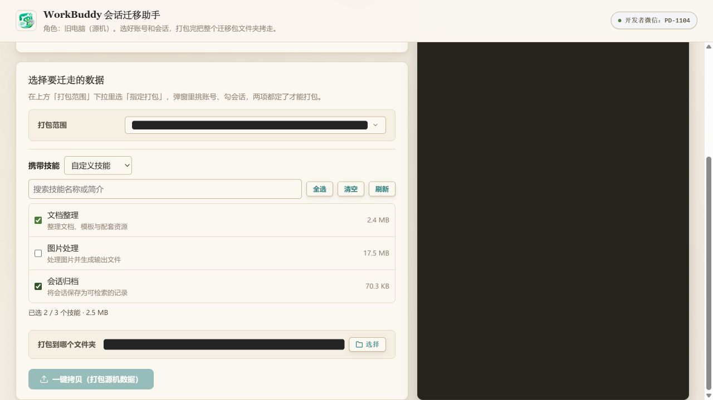
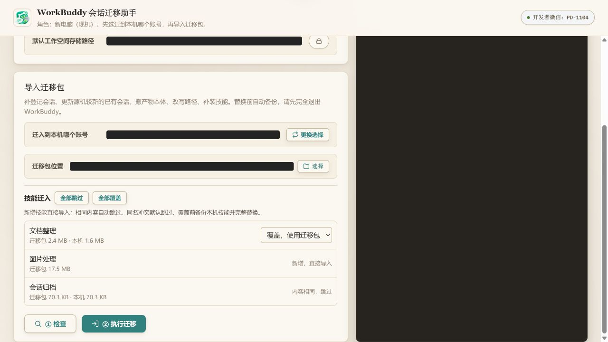

# WorkBuddy 会话迁移助手

Windows 桌面工具，用于把 WorkBuddy 的会话记录、项目文件和相关产物从旧电脑迁移到新电脑。

[下载 Windows 版本](https://github.com/PD-1004/workbuddy-migrate/releases/latest)

选择这台电脑的角色，按提示完成打包或迁入。

## 功能

- **全部或指定迁移**：旧电脑可打包全部会话，也可按账号、项目和会话选择需要迁移的内容。
- **路径识别与调整**：自动识别 WorkBuddy 缓存目录和工作空间目录，也可按 WorkBuddy「设置 → 通用」中显示的路径手动选择。
- **会话与产物一起迁移**：打包会话数据库、会话正文、相关索引、项目文件与产物；新电脑导入时将源机路径改写为本机路径。
- **重复迁移支持更新**：补入本机缺少的会话；已有会话仅在源机更新时间更晚时更新。已有会话保留本机账号归属，新增会话使用导入时选定的账号。
- **技能按需携带**：支持不携带、携带全部或自定义勾选，展示实际技能名称、简介和大小；选中技能连同整个目录及资源一起打包，有效链接指向的内容会复制为实际文件。失效或循环链接对应的技能会单独标记并跳过，其他技能仍可迁移。全部迁移默认携带全部技能，指定迁移默认不携带，均可自行调整。
- **技能冲突处理**：新技能直接导入，内容相同自动跳过；同名但内容不同的技能由用户逐项选择跳过或覆盖，默认跳过，也可批量设置。覆盖前备份本机旧技能，再完整替换目录；技能拷贝失败时恢复本次已替换的技能。
- **文件内容比对**：拷贝文件按实际内容比较，内容不同但大小相同的文件也能更新。
- **备份与失败恢复**：执行前备份数据库及将替换的文件；已有会话更新失败时回滚数据库并恢复已备份文件，便于重试。
- **版本提醒**：启动时检查版本，只有发现新版才显示右上角「更新」入口并弹窗提示；点击「前往下载」打开本仓库的发行页面。当前已是最新版或检查失败时不显示入口。
- **运行日志**：在日志容器内滚动查看，日志增多不会撑高窗口；运行时不生成 `wbmig-log.txt` 文件。

## 界面预览

旧电脑可以按需携带技能，自定义勾选时查看名称、简介与大小。

新电脑检查迁移包后，可对同名技能选择跳过或覆盖，也可批量设置。

界面图使用示例数据，账号、路径等信息已遮挡。

## 使用方法

1. 两台电脑均下载迁移助手。进行迁移前，完全退出 WorkBuddy。
2. 在旧电脑选择「旧电脑（源机）」，确认缓存与工作空间路径，选择全部或指定项目/会话，再选择是否携带技能。自定义模式可搜索、勾选技能，确认大小后生成迁移包。
3. 通过 U 盘、网盘或其他方式，将整个迁移包文件夹传到新电脑。
4. 在新电脑选择「新电脑（现机）」，确认本机路径并选择迁移包，选择迁入账号后先检查；在「技能迁入」中确认同名技能的跳过或覆盖选项，再执行迁移。
5. 查看执行结果，再启动 WorkBuddy。备份位于迁移包中的 `_backup_日期时间` 文件夹。

如果检查提示数据库缺失或为空，请核对新电脑收到的迁移包内是否存在 `缓存目录/workbuddy.db`，并与源机核对文件大小；重新传输完整迁移包。数据库缺少 `sessions` 表时，确认源机缓存路径和 WorkBuddy 数据库格式后重新打包。检查不会为缺失的源数据库创建空库。

本机会话时间更新或与源机相同的会话会保留；相同时间的内容冲突不会自动合并。更新提醒需要联网，离线时仍可迁移。下载新版后需自行更换 EXE。

技能选项仅调整 `skills` 目录，不会省略 `blobs`、剪贴板图片等其他公共数据。未携带技能时，会话仍可迁移；继续执行依赖这些技能的任务，需在新电脑自行安装。若浏览器无法启动而进入原有简化界面，沿用携带全部技能、同名技能跳过的方式。

开发者微信：**PD-1104**；公众号：**掌心向暖RPA自动化**。
